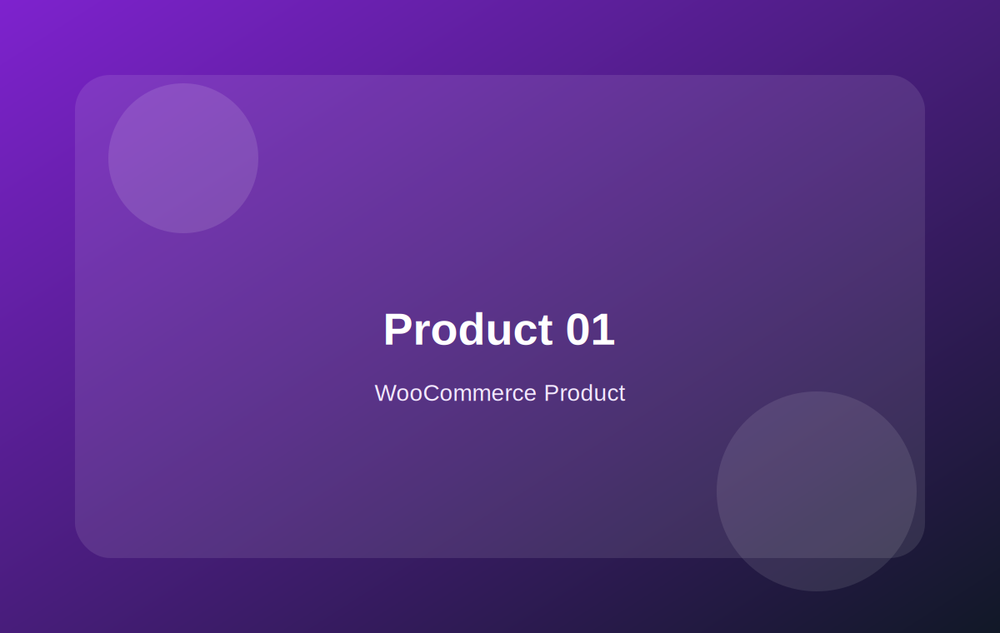

# WooCommerce Frontend Page Learning Kit

一个从 **静态 HTML 页面设计** 开始，逐步学习 **WooCommerce 前台商城页面结构**，并进一步过渡到 **WooCommerce 动态模板接入** 的学习包。

本项目适合已经了解 WooCommerce 后台基础操作，但希望继续深入学习前台页面结构、产品列表、产品详情页、产品变体交互、购物车、结账页、账户页，以及后续如何接入 WooCommerce 动态数据的人。

---

## 项目简介

很多 WooCommerce 学习资料一开始就进入 PHP、hooks、模板覆盖、支付、订单和复杂二次开发，这对于前台页面学习来说容易过早进入复杂阶段。

这个项目采用更适合循序渐进学习的方式：

```text
静态 HTML 页面
↓
产品卡片和产品列表
↓
品牌风格产品详情页
↓
规格选项和变体图片联动
↓
购物车、结账、账户页静态结构
↓
静态页面到 WooCommerce 动态模板的接入思路
```

你可以先不依赖 WordPress 或 WooCommerce 环境，直接打开 HTML 页面学习页面结构、布局方式、交互逻辑和响应式设计。等页面结构理解清楚后，再逐步学习如何把这些静态模块替换为 WooCommerce 的真实产品数据和模板输出。

---

## 项目特点

- 使用纯 HTML + CSS + JavaScript 编写
- 不依赖 WordPress 或 WooCommerce 环境
- 下载后可直接打开 `index.html` 学习
- 适合作为 WooCommerce 前台页面练习项目
- 覆盖产品卡片、产品列表、产品详情页、变体选项、购物车、结账和账户页
- 包含静态页面如何接入 WooCommerce 动态模板的学习章节
- 重点强调“先保留结构，再替换数据”的动态化思路
- 适合后期继续改造成 WooCommerce 主题模板参考

---

## 适合人群

本项目适合：

- 想学习 WooCommerce 前台页面结构的人
- 已经会一些 HTML / CSS，希望练习电商页面的人
- 觉得 WooCommerce PHP / hooks 暂时有难度的人
- 想先从产品卡片、产品列表、产品详情页开始学习的人
- 想把静态 HTML 页面逐步改造成 WooCommerce 动态模板的人
- 想为后期制作 WooCommerce 主题或子主题打基础的人

不适合：

- 想直接得到完整 WooCommerce 主题的人
- 想直接得到支付、订单、库存、物流完整开发方案的人
- 想一开始就深入 WooCommerce hooks、REST API、HPOS 的人

---

## 当前版本

```text
v1.3.1
```

当前版本重点：

- 修复动态化路线页面布局错位问题
- 扩展静态页面到 WooCommerce 动态模板的学习章节
- 增加 21-26 页面，讲解静态 HTML 如何过渡到真正的 WooCommerce 动态页面
- 进一步完善产品卡片、产品列表、产品详情、变体数据、购物车、结账和账户页的接入思路

---

## 页面目录

本项目当前包含 26 个学习页面。

### 第一部分：WooCommerce 前台静态页面基础

| 页面 | 主题 | 学习重点 |
|---|---|---|
| `01-page-structure.html` | 页面结构 | Header、Main、Section、Footer |
| `02-header-navigation.html` | 头部导航 | Logo、菜单、账户、购物车 |
| `03-hero-banner.html` | 首页 Banner | 标题、卖点、按钮、产品图 |
| `04-product-card.html` | 产品卡片 | 产品图、标题、价格、按钮 |
| `05-product-grid.html` | 产品列表 | Grid 三列产品展示 |
| `06-responsive-grid.html` | 响应式产品列表 | 桌面多列、手机一列 |
| `07-category-sidebar.html` | 分类侧边栏 | 分类筛选、价格筛选、侧栏布局 |
| `08-toolbar-filter.html` | 搜索筛选栏 | 搜索、排序、结果数量 |
| `09-card-details.html` | 产品卡片细节 | 徽章、评分、原价、促销价 |
| `10-list-view.html` | 列表视图 | 横向产品列表 |
| `11-pagination.html` | 分页 | 产品列表分页结构 |

### 第二部分：产品详情页和购买流程静态页面

| 页面 | 主题 | 学习重点 |
|---|---|---|
| `12-product-detail.html` | 产品详情页 | Swiper 主图轮播、缩略图、购买信息 |
| `13-product-gallery.html` | 产品图集 | Swiper 主图 + 缩略图联动 |
| `14-variation-selector.html` | 规格选项 | 品牌风格产品详情页、变体图片联动 |
| `15-product-tabs.html` | 产品详情 Tab | 描述、规格、安装、评价 |
| `16-related-products.html` | 相关产品 | 推荐产品、配件、同类产品 |
| `17-cart-page.html` | 购物车页面 | 商品、数量、小计、订单汇总 |
| `18-checkout-page.html` | 结账页面 | 账单信息、配送、订单确认 |
| `19-account-orders.html` | 账户订单页面 | 我的账户、订单列表、状态标签 |
| `20-complete-store-page.html` | 完整商店页面 | Header、Hero、产品列表、分页整合 |

### 第三部分：静态页面到 WooCommerce 动态页面

| 页面 | 主题 | 学习重点 |
|---|---|---|
| `21-dynamic-roadmap.html` | 动态化路线 | 静态 HTML 到 WooCommerce 模板的整体路线 |
| `22-product-card-loop.html` | 产品卡片动态化 | 从静态卡片到 WooCommerce Product Loop |
| `23-shop-archive-template.html` | 商店列表动态化 | 从产品 Grid 到 Shop / Category Archive |
| `24-single-product-template.html` | 产品详情动态化 | 从静态详情页到 Single Product Template |
| `25-variation-data.html` | 变体数据动态化 | 从 `data-*` 到 WooCommerce Variation Data |
| `26-cart-checkout-account.html` | 购物车、结账和账户页 | 先保留默认流程，再做样式优化 |

---

## 文件结构

```text
woocommerce-frontend-page-learning-kit/
├── index.html
├── 01-page-structure.html
├── 02-header-navigation.html
├── 03-hero-banner.html
├── 04-product-card.html
├── 05-product-grid.html
├── 06-responsive-grid.html
├── 07-category-sidebar.html
├── 08-toolbar-filter.html
├── 09-card-details.html
├── 10-list-view.html
├── 11-pagination.html
├── 12-product-detail.html
├── 13-product-gallery.html
├── 14-variation-selector.html
├── 15-product-tabs.html
├── 16-related-products.html
├── 17-cart-page.html
├── 18-checkout-page.html
├── 19-account-orders.html
├── 20-complete-store-page.html
├── 21-dynamic-roadmap.html
├── 22-product-card-loop.html
├── 23-shop-archive-template.html
├── 24-single-product-template.html
├── 25-variation-data.html
├── 26-cart-checkout-account.html
├── css/
│   └── common.css
├── js/
│   └── main.js
├── assets/
│   └── *.svg
└── README.md
```

---

## 如何使用

### 方法一：直接打开学习

1. 下载并解压项目
2. 双击打开 `index.html`
3. 按页面编号从 01 学到 26
4. 在浏览器中查看每个页面的布局和交互

### 方法二：使用 VS Code + Live Server

1. 用 VS Code 打开整个项目文件夹
2. 安装 Live Server 插件
3. 右键 `index.html`
4. 选择 `Open with Live Server`
5. 修改 HTML、CSS、JS 后实时预览效果

### 方法三：作为 WooCommerce 主题开发前的静态原型

你可以先在这个项目中完成：

- 产品卡片设计
- 产品列表布局
- 产品详情页布局
- 产品图集交互
- 颜色 / 规格选择交互
- 购物车、结账、账户页视觉结构

然后再逐步把这些静态结构迁移到 WooCommerce 主题模板中。

---

## 推荐学习路线

### 阶段 1：先理解页面结构

```text
01 页面结构
↓
02 头部导航
↓
03 首页 Banner
```

这一阶段重点理解一个商城页面由哪些大区块组成。

---

### 阶段 2：学习产品卡片和产品列表

```text
04 产品卡片
↓
05 产品列表
↓
06 响应式产品列表
↓
07 分类侧边栏
↓
08 搜索筛选栏
↓
09 产品卡片细节
↓
10 列表视图
↓
11 分页
```

这一阶段重点理解 WooCommerce 商店页、分类页、搜索结果页的基础结构。

---

### 阶段 3：学习产品详情页

```text
12 产品详情页
↓
13 产品图集
↓
14 规格选项
↓
15 产品详情 Tab
↓
16 相关产品
```

这一阶段重点理解单产品页的结构，包括产品图、价格、SKU、规格选项、变体图片、详情内容和相关产品。

---

### 阶段 4：学习购买流程页面

```text
17 购物车页面
↓
18 结账页面
↓
19 账户订单页面
↓
20 完整商店页面
```

这一阶段重点理解购物流程中的核心页面。

---

### 阶段 5：学习如何动态化

```text
21 动态化路线
↓
22 产品卡片动态化
↓
23 商店列表动态化
↓
24 产品详情动态化
↓
25 变体数据动态化
↓
26 购物车、结账和账户页接入建议
```

这一阶段重点理解如何把静态 HTML 页面逐步变成真正的 WooCommerce 动态页面。

---

## 核心学习思路

本项目的核心学习思路是：

```text
先做静态页面
↓
再拆分成模块
↓
然后替换动态数据
↓
最后接入 WooCommerce 模板
```

不要一开始就想着完全重写 WooCommerce 页面。更稳的方式是：

1. 保留你已经写好的 HTML 结构
2. 保留 CSS class 和页面布局
3. 先替换产品标题、价格、图片、链接
4. 再替换产品列表循环
5. 再处理产品详情页
6. 最后处理变体、购物车、结账和账户页

---

## 静态页面和 WooCommerce 动态模板的对应关系

| 静态页面模块 | WooCommerce 动态来源 | 常见模板 / 函数 |
|---|---|---|
| 产品卡片 | Product Loop | `content-product.php` |
| 产品列表 | Shop / Category Archive | `archive-product.php` |
| 产品标题 | 当前产品标题 | `the_title()` |
| 产品图片 | 产品缩略图 | `woocommerce_template_loop_product_thumbnail()` |
| 产品价格 | WooCommerce 价格 HTML | `woocommerce_template_loop_price()` / `$product->get_price_html()` |
| 产品详情页 | Single Product | `single-product.php` |
| 产品主图 | Featured Image | `get_the_post_thumbnail()` |
| 产品图集 | Gallery Images | `$product->get_gallery_image_ids()` |
| 加入购物车 | Add to Cart | `woocommerce_template_single_add_to_cart()` |
| 规格变体 | Variation Data | Variable Product |
| 购物车页面 | Cart Template / Cart Block | WooCommerce Cart |
| 结账页面 | Checkout Template / Checkout Block | WooCommerce Checkout |
| 我的账户 | My Account Endpoints | WooCommerce My Account |

---

## 从静态产品卡片到动态产品卡片

静态产品卡片通常是这样：

```html
<article class="product-card">
  
  <h3>Product 01</h3>
  <p class="price">$39.00</p>
  <a class="button" href="#">View Product</a>
</article>
```

动态化后，核心思路是把静态内容替换成 WooCommerce 数据：

```php
<article <?php wc_product_class( 'product-card', $product ); ?>>
  <a href="<?php the_permalink(); ?>">
    <?php woocommerce_template_loop_product_thumbnail(); ?>
  </a>

  <h3><?php the_title(); ?></h3>

  <div class="price">
    <?php woocommerce_template_loop_price(); ?>
  </div>

  <?php woocommerce_template_loop_add_to_cart(); ?>
</article>
```

建议先只动态化：

- 产品图片
- 产品标题
- 产品价格
- 产品链接
- 按钮

再考虑：

- Sale 标记
- Featured 标记
- 评分
- 分类
- 产品属性

---

## 从静态产品列表到 WooCommerce Shop 页面

静态产品列表通常是：

```html
<div class="grid">
  <article class="product-card">...</article>
  <article class="product-card">...</article>
  <article class="product-card">...</article>
</div>
```

动态化后，可以理解为：

```php
<div class="grid">
  <?php if ( woocommerce_product_loop() ) : ?>

    <?php while ( have_posts() ) : ?>
      <?php the_post(); ?>
      <?php wc_get_template_part( 'content', 'product' ); ?>
    <?php endwhile; ?>

  <?php endif; ?>
</div>
```

你现在的静态 Grid 布局仍然可以保留，只是里面的产品卡片不再手写，而是由 WooCommerce 产品循环输出。

---

## 从静态产品详情页到 Single Product

静态产品详情页通常包含：

- 产品主图
- 缩略图
- 标题
- 评分
- 价格
- SKU
- 产品描述
- 规格选项
- 数量
- 加入购物车按钮
- 相关产品

动态化时建议按顺序接入：

```text
产品标题
↓
产品价格
↓
SKU
↓
短描述
↓
产品主图
↓
产品图集
↓
Add to Cart
↓
产品 Tab
↓
相关产品
↓
变体数据
```

不要一开始就同时改图集、变体、按钮和购物车逻辑，否则排查会比较困难。

---

## 规格选项和变体数据

本项目中的 `14-variation-selector.html` 使用 `data-*` 模拟了 WooCommerce 变体数据。

例如：

```html
<button
  data-variation-option
  data-image="assets/product-02.svg"
  data-name="Walnut Decking"
  data-price="$42.00"
  data-sku="DECK-WALNUT-220"
  data-description="Darker premium tone..."
>
  Walnut
</button>
```

后期接入 WooCommerce 时，可以这样理解：

| 静态字段 | WooCommerce 变体数据 | 用途 |
|---|---|---|
| `data-image` | Variation Image | 切换产品主图 |
| `data-name` | Variation Attribute / Display Name | 更新当前选项名称 |
| `data-price` | Variation Price HTML | 更新价格 |
| `data-sku` | Variation SKU | 更新 SKU |
| `data-description` | Variation Description | 更新变体说明 |
| 库存标签 | Variation Availability | 显示库存状态 |

建议先使用 WooCommerce 默认可变产品表单，理解它如何工作，再尝试把默认变体数据映射到你自己的品牌化 UI。

---

## 购物车、结账、账户页建议

购物车、结账和账户页涉及真实订单流程，不建议一开始完全重写。

建议顺序：

```text
先使用 WooCommerce 默认页面
↓
确认购物车、结账、支付、订单邮件正常
↓
再用 CSS 优化外观
↓
再局部覆盖模板
↓
最后才考虑自定义功能
```

### 购物车页面

优先保留：

- 数量更新
- 优惠券
- 小计
- 运费计算
- 库存校验

可以先优化：

- 表格样式
- 按钮样式
- 空购物车提示
- 订单汇总卡片

### 结账页面

优先保留：

- 字段验证
- 地址填写
- 配送方式
- 支付方式
- 订单创建

可以先优化：

- 字段间距
- 分栏布局
- 订单摘要样式
- 按钮样式

### 我的账户页面

优先保留：

- 登录状态
- 订单列表
- 地址管理
- 下载
- 账户详情
- Logout

可以先优化：

- 菜单样式
- 订单表格
- 状态 badge
- 账户中心布局

---

## 版本更新记录

### v1.3.1

- 修复 `21-dynamic-roadmap.html` 页面布局错位问题
- 将动态化路线页面改为更稳定的路线图卡片和时间线布局
- 扩展 `22-product-card-loop.html`
- 扩展 `23-shop-archive-template.html`
- 扩展 `24-single-product-template.html`
- 扩展 `25-variation-data.html`
- 扩展 `26-cart-checkout-account.html`
- 补充产品卡片、产品列表、产品详情页、变体数据、购物车、结账和账户页的接入说明
- 更新 `css/common.css`
- 更新 `README.md`

### v1.2.0

- 重点优化 `14-variation-selector.html`
- 将规格选项页面升级为品牌风格产品详情页
- 优化变体图片联动
- 点击颜色或缩略图时同步更新主图、标题、价格、SKU 和描述
- 增加卖点卡片、Request Sample、Download Specs 等内容
- 优化手机端显示效果

### v1.1.0

- 优化产品详情页 Swiper 主图轮播
- 优化产品图集 Swiper 缩略图
- 优化分类侧边栏布局
- 优化账户订单页面

### v1.0.0

- 创建基础 WooCommerce HTML 页面学习包
- 包含 20 个静态 HTML 学习页面
- 覆盖页面结构、产品卡片、产品列表、产品详情、购物车、结账和账户页面

---

## 后续可继续扩展方向

这个项目后续可以继续扩展：

- WooCommerce 模板覆盖实战
- `content-product.php` 完整改造示例
- `archive-product.php` 完整改造示例
- `single-product.php` 完整改造示例
- WooCommerce 产品筛选侧栏动态化
- WooCommerce 可变产品前端 UI 改造
- WooCommerce 购物车页面样式优化
- WooCommerce 结账页面样式优化
- WooCommerce My Account 页面样式优化
- WooCommerce Block 页面和传统模板的区别

---

## 技术栈

- HTML5
- CSS3
- JavaScript
- Responsive Design
- Swiper
- SVG placeholder assets
- WooCommerce template learning notes

---

## 注意事项

本项目是学习包，不是完整 WooCommerce 主题。

如果要用于真实 WooCommerce 网站，需要进一步处理：

- WordPress 主题结构
- WooCommerce 模板覆盖
- PHP 模板文件
- 产品循环
- 产品对象
- 变体数据
- 购物车和结账流程
- 支付方式
- 订单邮件
- 安全和兼容性测试

请不要直接把静态 HTML 当作完整 WooCommerce 主题使用。

---

## License

MIT License
